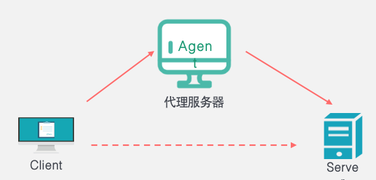
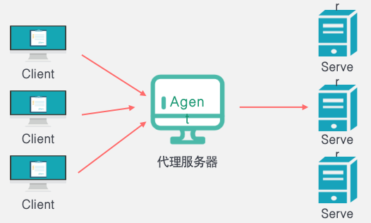
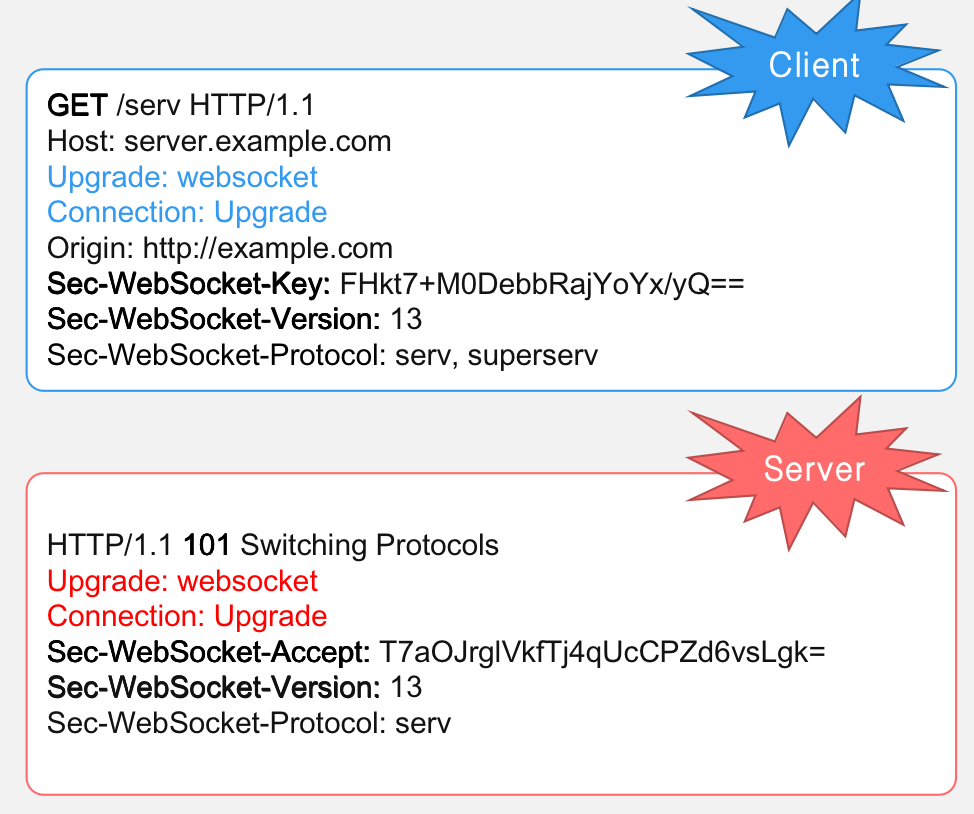
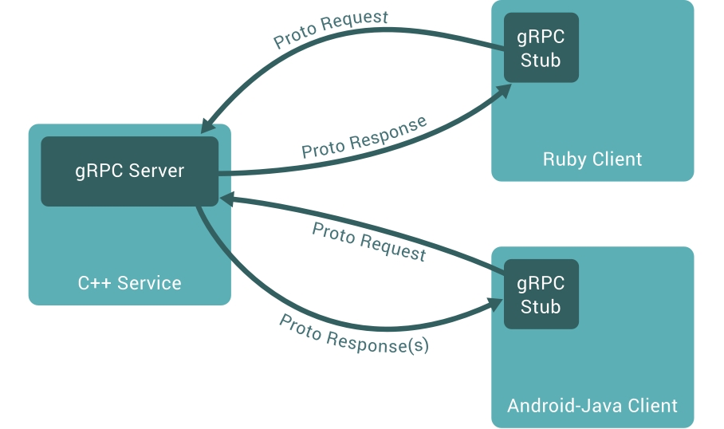
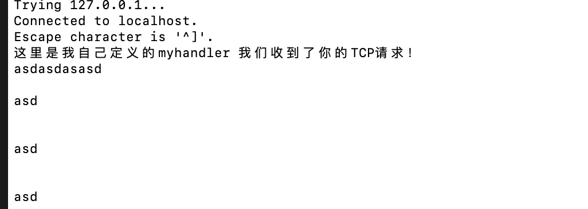
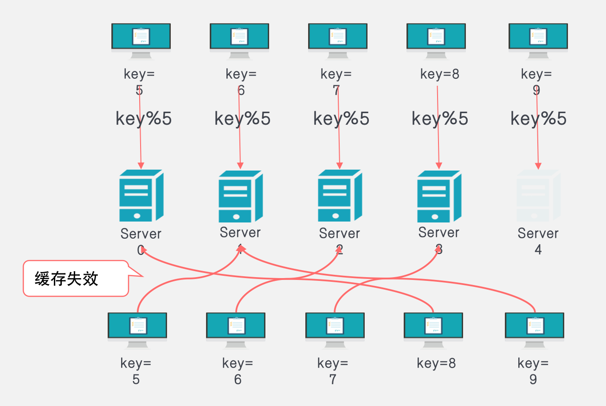
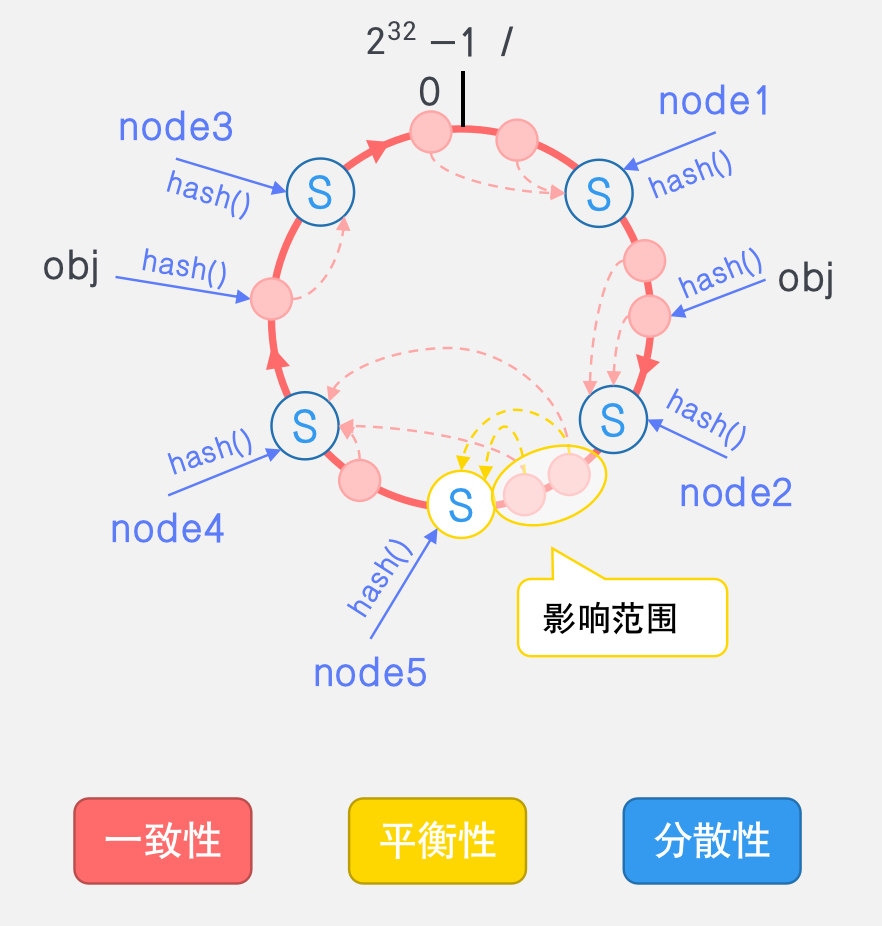

### Microservices Gateway Project 

> 「Implemented by the Golang」


#### 网络代理

网络代理负责 控制 和 管理 对某个网络主机的访问

- 控制：客户端/服务器流量控制、黑白名单、权限校验和URL重写
- 管理：流量统计、编解码、Header头转换、负载均衡、服务发现、连接池


正向代理「客户端代理」：帮助**客户端**访问无法访问的服务器资源，隐藏用户真实IP 「VPN、浏览器web代理等」

>  步骤：
>
> - 代理服务器接收客户端请求，复制，封装成新请求
> - 发送新请求到真实服务器，接收响应
> - 处理响应并返回客户端
>
> 我这里用的是Mac系统，因此讲一下一些相关的配置：
>
> Mac代理设置：关于本机 -> 偏好设置 -> 网络 -> 高级 -> 代理设置.  或者配置 ~/.bash_profile
>
> Mac查看本机ip：`ifconfig`
>
> 注：配置完正向代理，所有的请求都会先经过正向代理




反向代理「服务端代理」：为**服务器**做负载均衡、缓存、提供安全校验等，隐藏服务器真实IP。「LVS技术、nginx proxy_pass等」

> 




#### HTTP代理


#### WebSocket代理

解决服务端无法主动向客户端推送的问题，应用层协议，兼容HTTP，使用相同的端口

- 真正意义的全双工：C/S地位对等
- 长连接
- 服务端可以主动向客户端发消息

使用HTTP Upgrade机制进行握手

使用TCP作为传输层协议，支持TLS

- ws://host:port/path/query   (80端口)	
- wss://host:port/path/query (443端口)



> 101 代表着切换协议
>
> Websocket所有请求都是GET请求


#### TCP代理

基于流式数据及无状态数据的管理，关注流量控制及请求来源控制

> 参考HTTP代理实现了TCP的代理服务器


#### gRPC代理

> 谷歌出品的高性能、开源、通用的RPC框架
>
> - 基于HTTP/2设计,双向流、流控、头部压缩、单TCP多路复用
> - 面向服务端和移动端：节省空间、省电
> - 支持众多语言C++、Go、Java、Python
> - 使用 protobuf 作为IDL「接口定义语言」
>
> 基本理念：
>
> 1、定义一个服务，指定其能够被远程调用的方法（即函数，包含参数和返回类型） 
>
> 2、在服务端实现这个接口，并运行一个 gRPC服务器来处理客户端调用 
>
> 3、客户端有一个存根，即跟服务端一样的方法回调被调用的 A 方法，唤醒正在等待响应（阻塞）的客户端调用并返回响应结果
>
> 总结：rpc就是像调用本地函数一样嗲用远程函数




>  Go语言默认rpc序列化方式是gob

`nc -l host:port`：模拟TCP服务器进行监听

---

gPRC服务器和客户端实现

- 编写并编译proto文件「定义了传输数据的格式」，定义服务和消息体 「需要自己定义消息格式」

  > $ protoc --go_out=plugins=grpc:. *.proto
  >
  > 一般会生成两个文件
  >
  > - xxx.pb.go：和message相关的内容
  > - xxx_grpc.pb.go：和grpc服务相关的内容

- 注册gRPC服务并启动

  > ```go
  > // 注册gRPC服务，绑定对象方法
  > grpcServer := grpc.NewServer()
  > pb.RegisterHelloServiceServer(grpcServer, &HelloService{})
  > // 创建设置监听
  > listener, err := net.Listen("tcp", "127.0.0.1:8004")
  > if err != nil {
  >    fmt.Println("listen err!")
  >    return
  > }
  > fmt.Println("listen port 127.0.0.1:8004 ....")
  > defer listener.Close()
  > // 绑定服务：将监听绑定rpc服务
  > grpcServer.Serve(listener)
  > ```

- 创建客户端远程调用函数

  > ```go
  > // 使用 gRPC 链接服务器
  > // 抑制安全策略，不使用TLS层安全握手
  > grpcConn, err := grpc.Dial("127.0.0.1:8004", grpc.WithTransportCredentials(insecure.NewCredentials()))
  > 
  > defer grpcConn.Close()
  > // 初始化客户端
  > grpcClient := pb.NewHelloServiceClient(grpcConn)
  > reply, err := grpcClient.Hello(context.Background(), &pb.Person{Name: "小鱼", Age: 10})
  > 
  > fmt.Println("收到回复" + reply.String())
  > ```

**gprc支持的四种服务方法**：

- 一元 RPC(Unary)，客户端向服务器发送单个请求并返回单个响应，就像普通的函数调用一样

  > rpc SayHello(HelloRequest) returns (HelloResponse);

- 服务器流式处理(Server streaming) RPC，客户端向服务器发送请求并获取流以读回一系列消息

  > rpc LotsOfReplies(HelloRequest) returns (stream HelloResponse);
  >
  > 客户端发送一个消息，服务器回复一系列的消息「要保证顺序」

- 客户端流式处理(Client streaming) RPC，客户端写入一系列消息并将其发送到服务器，等待服务器读取并应答

  > rpc LotsOfGreetings(stream HelloRequest) returns (HelloResponse);
  >
  > 客户端发送一系列消息，服务器回复一个消息

- 双向流式处理(Bidirectional streaming) RPC，其中双方都使用读写流发送一系列消息。两个流独立运行

  > rpc BidiHello(stream HelloRequest) returns (stream HelloResponse);
  >
  > 相当于建立了两个管道「独立运行，HTTP2的特点」

---

metadata元数据`map[string][]string 或者 map[string]string`的作用：

- 一般携带token、timestamp、授权信息

```go
// 服务端
	// 从上下文拿到元数据
	if md, ok := metadata.FromIncomingContext(ctx); ok {
		// 根据需要进行解析
		fmt.Println("md : ", md)
	} else {
		log.Println("miss metadata from context")
	}
```

```go
// 客户端
// 封装元数据
md := metadata.Pairs("timestamp", time.Now().Format(time.StampNano)) // 两个参数为一组
md.Append("hobby", "fxxk", "make", "love")
ctx := metadata.NewOutgoingContext(context.Background(), md)
```


#### Bug记录

- 请求完之后没有自动关闭连接

  

  > ```go
  > func (c *conn) serve(ctx context.Context) {
  > 	defer func() {
  > 		if err := recover(); err != nil && err != ErrAbortHandler {
  > 				// ... 省略操作
  > 		}
  > 		// 服务完之后关闭连接
  > 		c.rwc.Close()
  > 	}()
  > 	// ... 其他操作
  > }
  > ```

- 


### 负载均衡

#### 轮询算法

比较好理解，类似一个循环数组不断地进行轮询

```go
// 轮询算法
type RoundRobinBalance struct {
	// 服务器主机地址
	servAddrs []string
	// 当前轮询的结点索引
	curIndex int
}

func (r *RoundRobinBalance) Add(params ...string) error {
	if len(params) == 0 {
		return errors.New("The param's length is 0! It should at least 1!s")
	}
	for i := 0; i < len(params); i++ {
		r.servAddrs = append(r.servAddrs, params[i])
	}
	return nil
}

func (r *RoundRobinBalance) Next() string {
	lens := len(r.servAddrs)
	if lens == 0 {
		return ""
	}
	addr := r.servAddrs[r.curIndex]
	r.curIndex = (r.curIndex + 1) % lens
	return addr
}

```

#### 加权轮询算法

- Weight：初始化权重，默认1
- currentWeight：节点当前权重，每一轮可能变化
- effectiveWeight：节点有效权重，故障-1
- maxFails：在failTimeout时间内，最大失败次数。达到最大失败次数时，在failTimeout时间内不能被再次选择
- failTimeout：指定时间段内最大失败次数「单位为秒，默认值10秒」达到maxFails后，该server不能被访问的时间

```go
package loadbalance

import (
	"errors"
	"fmt"
	"strconv"
	"time"
)

// 加权轮询算法
type WeightRoundRobinBalance struct {
	// 服务器主机地址
	servAddrs []*node
	// 当前轮询的结点索引
	curIndex int
}

const (
	MaxFails    int           = 3
	FailTimeout time.Duration = time.Second * 3
)

/*
node 每个服务器结点有不同的权重，并且在每一轮访问后可能会发生变化
*/
type node struct {
	// 主机地址 host:port
	addr string
	// 初始化权重
	weight int
	// 结点当前的临时权重，每一轮都可能变化  currentWeight = currentWeight + effectiveWeight
	// 每一轮都选择权重最大的结点
	currentWeight int
	// 有效权重，默认与weight相同，每当发生故障时，有效权重-1
	effectiveWeight int
	// failTimeout内最大失败次数，如果到达，则在failTimeout内不能再被选择
	maxFails int
	// 指定超时到时见「用于衡量最大失败次数，也用于超时」
	failTimeout time.Duration
	// 失败的时间结点
	failTimes []time.Time // 类似一个滑动窗口
}

/*
添加带权重的服务器主机
格式： "host:port","weight","host:port","weight", ... ,"host:port","weight"
*/
func (r *WeightRoundRobinBalance) Add(params ...string) error {
	length := len(params)
	if length == 0 || length%2 == 1 {
		return errors.New("The param's length is error!")
	}
	for i := 0; i < length; i += 2 {
		addr := params[i]
		weight, err := strconv.ParseInt(params[i+1], 10, 32)
		if err != nil {
			return err
		}
		// 默认权重为1
		if weight <= 0 {
			weight = 1
		}
		n := node{
			addr:            addr,
			weight:          int(weight),
			currentWeight:   0,
			effectiveWeight: int(weight),
			maxFails:        MaxFails,
			failTimeout:     FailTimeout,
		}
		r.servAddrs = append(r.servAddrs, &n)
	}
	return nil
}

// 找到权重最大的下一个服务器
/*

为了避免每次都访问同一个服务器，每一轮选中之后，需要对其进行降权

*/
func (r *WeightRoundRobinBalance) Next() (string, error) {
	lens := len(r.servAddrs)
	if lens == 0 {
		return "", errors.New("Ne server address!")
	}
	var index int = 0
	var maxNode *node = nil
	effectiveWeightSum := 0
	// 循环计算每个服务器的权值，选择最大的返回；
	// 对选中的服务器进行降权 ：currentWeight - sum(effectiveWeight)
	for i, servNode := range r.servAddrs {
		// 计算每个服务器的权重: 临时权重 + 有效权重  「选中最大的临时权重结点」
		servNode.currentWeight += servNode.effectiveWeight
		if servNode.maxFails <= 0 { // 不能被选中
			refreshErrRecords(servNode)
			servNode.maxFails = MaxFails - len(servNode.failTimes)
			if servNode.maxFails <= 0 {
				fmt.Println(servNode.addr, " 进入小黑屋！")
				continue
			}
		}
		if maxNode == nil || servNode.currentWeight > maxNode.currentWeight {
			maxNode = servNode
			index = i
		}
		effectiveWeightSum += servNode.effectiveWeight
	}
	// 对选中结点进行降权
	maxNode.currentWeight -= effectiveWeightSum
	r.curIndex = index
	return maxNode.addr, nil
}

// 奖励与惩罚策略」
func (r *WeightRoundRobinBalance) CallBack(addr string, flag bool) {
	for i := 0; i < len(r.servAddrs); i++ {
		w := r.servAddrs[i]
		if w.addr == addr {
			if flag {
				// 防止有效权重超过初始权重
				if w.effectiveWeight < w.weight {
					w.effectiveWeight++
				}
			} else { // 访问服务器失败
				w.effectiveWeight--
				// 刷新错误时间表
				refreshErrRecords(w)
				// 添加当前错误时间点
				w.failTimes = append(w.failTimes, time.Now())
				// 更新时间段内错误次数
				w.maxFails = MaxFails - len(w.failTimes)
			}
			break
		}
	}
}

func refreshErrRecords(w *node) {
	now := time.Now()
	var i = 0
	for len(w.failTimes) > i && now.Sub(w.failTimes[i]) >= w.failTimeout {
		i += 1
	}
	w.failTimes = w.failTimes[i:]
}

func print(rb *WeightRoundRobinBalance, addr string) {
	fmt.Println(" 主机地址 \t\t\t当前权重\t有效权重")
	total := 0
	for j := 0; j < len(rb.servAddrs); j++ {
		w := rb.servAddrs[j]
		total += w.effectiveWeight
		cw := strconv.Itoa(w.currentWeight)
		ew := strconv.Itoa(w.effectiveWeight)
		if w.addr == addr {
			// 被选中的服务器高亮显示
			fmt.Printf("%c[1;0;31m%s%c[0m", 0x1B, addr, 0x1B)
		} else {
			fmt.Print(w.addr)
		}
		var str = "\t\t" + cw + "\t\t" + ew + "\t\t"
		fmt.Println(str)
	}
	fmt.Println("有效权重之和:\t\t\t\t" + strconv.Itoa(total))
}
```


#### 随机算法

```go
package loadbalance

import (
	"errors"
	"math/rand"
)

// 轮询算法
type RandomBalance struct {
	// 服务器主机地址
	servAddrs []string
}

func (r *RandomBalance) Add(params ...string) error {
	if len(params) == 0 {
		return errors.New("The param's length is 0! It should at least 1!s")
	}
	for i := 0; i < len(params); i++ {
		r.servAddrs = append(r.servAddrs, params[i])
	}
	return nil
}

func (r *RandomBalance) Next() string {
	lens := len(r.servAddrs)
	if lens == 0 {
		return ""
	}
	return r.servAddrs[rand.Intn(len(r.servAddrs))]
}

```

上述负载均衡算法使用前提是「**所有服务器提供的服务都是相同的，无法保证某类请求仅由特定的服务器处理**」，在微服务情况下不是很适用的！


#### 一致性哈希算法

hash算法：不可逆压缩算法一致性



> 如果某个服务器宕机或者故障，可能导致大量的缓存失效

hash：

- 一致性/单调性：某个结点失效了，仅仅重新映射宕机的结点
- 平衡性：虚拟节点
- 分散性：



> hash值与hash表位置的映射关系的一致性尽可能小地改变请求与处理请求服务器之间的映射关系
>
> 解决扩容/宕机时路由的大规模变化问题「扩容/宕机只会影响部分对象」，缓解分布式缓存大范围失效问题

### 相关面试题整理

---

grpc与http对比，grpc为啥好，基本原理是什么？

> 区别：
>
> - rpc是远程过程调用，就是本地去调用一个远程的函数，而http是通过 url和符合restful风格的数据包去发送和获取数据。
> - rpc的一般使用的编解码协议更加高效，比如grpc使用protobuf编解码。而http的一般使用json进行编解码，数据相比rpc更加直观，但是数据包也更大，效率低下
> - rpc一般用在**服务内部的相互调用**，而http则用于和用户交互。
>
> 相似点：
>
> - 都有类似的机制，例如grpc的metadata机制和http的头机制作用相似，而且web框架，和rpc框架中都有拦截器的概念
> - grpc是基于http2协议，可以实现多路复用的长连接，效率更高

---

服务端同时接收到两条同样的请求，如何滤除，只执行其中一个「小红书二面」

> 是考拦截器和过滤器吗？


---


